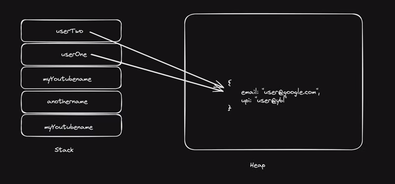

## Javascript Series:

# Variables and Data types
const = can't be re-assigned a value and can't be declared again (block scope) 
let = can be re-assigned a value but can't be declared again (block scope) 
var = it can be re-assigned a value and it can also be declared again (Global scope)
 => Never use var in your code instead of let because of block and functional scope issues. 
# console.table([group of variables you want to show in tabular form])
If a variable is declared and value is not initialized then it would return as `undefined` 

# Note: In javascript the equality and comparison operations are different
The reason is that an equality check == and comparisons > < >= <= work differently. 
Comparisons convert null to a number, treating it as 0. That’s why (3) null >= 0 is true and (1) null > 0 is false. 
On the other hand, the equality check == for undefined and null is defined such that, without any conversions, they equal each other and don’t equal anything else. 
That’s why (2) null == 0 is false. 
null is treated in a special way by the Equals Operator (==). 
In a brief, it only coerces to undefined:
 null == null; // true 
 null == undefined; // true
 Value such as false, '', '0', and [] are subject to numeric type coercion, all of them coerce to zero.

# Data types Summary:
There are two types based on how the data is stored in the memory and accessed 
1.	Primitive(call by value) :
String, number, Boolean, null, undefined, symbol, BigInt
2.	Non-primitive(Reference type):
Array, Objects, Functions

|Type of val | Result|
| --- | --- |
|Undefined | "undefined"|
|Null	| "object"|
|Boolean |	"boolean"|
|Number |	"number"|
|String	| "string"|
|Object (native and does not implement [[Call]]) |	"object"|
|Object (native or host and does implement [[Call]]) |	"function"|
|Object (host and does not implement [[Call]]) |	Implementation-defined except may not be "undefined", "boolean", "number", or "string".|

# Primitive Datatypes

| Type | typeof |
| --- | --- |
| Number | number|
| String  | string |
| Boolean | boolean |
| Bigint | bigint |
| Symbol | symbol |
| Null   | object |
| Undefined | undefined |

# Non-Primitive OR Referance OR Object datatype
| Type | typeof |
| --- | --- |
| Object |  object |
| Array | object |
| Function | function(object) |

# Stack and Heap Memory

Primitive dataType goes in stack memory; And it provides copy of that element.
So when we change something (through assigned variable) it gets changed in copy of element  not in original.

Opposite of this. Non primitive dataType get stored in HEAP memory. 
And it gives reference value to assigned elements. 
So when assigned variable makes changes it changes the both values(original and assigned one. 

